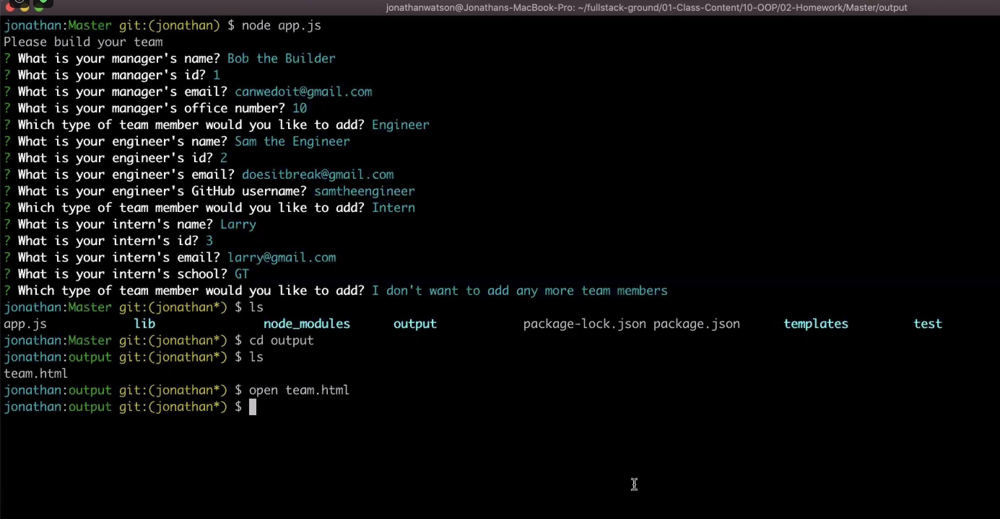
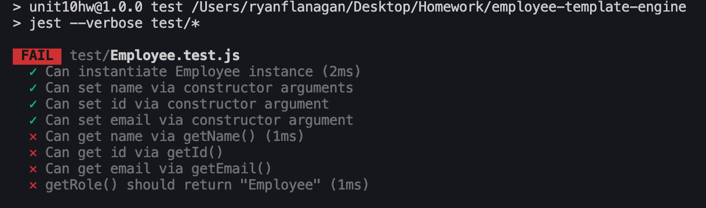
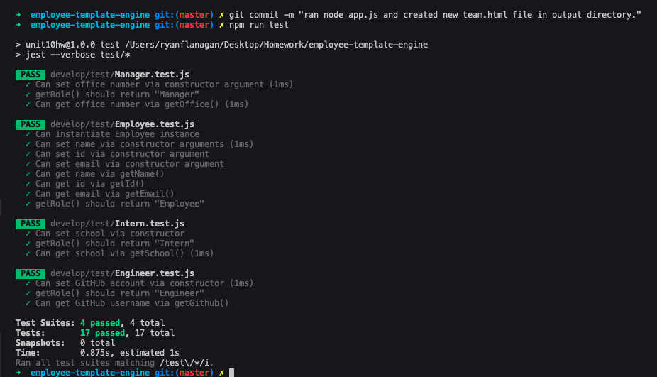

# employee-template-engine

## Description
This team generator command line application will prompt the user for information about the team manager and then information about the team members. The user can input any number of team members, and they may be a mix of engineers and interns.

## App Demonstration
[Watch the video of this application in use here:](https://drive.google.com/file/d/1tvE6aTl9xUIEOJMt8e1oy_r60CRwq02Y/view)

## Contents
This application contains the following elements:

* Develop directory which includes:
* [app.js](https://github.com/RFlanagan82/good-readme-generator/blob/master/index.js)
* [libary](https://github.com/RFlanagan82/employee-template-engine/tree/master/develop/lib)
* [templates](https://github.com/RFlanagan82/employee-template-engine/tree/master/develop/templates)
* [test](https://github.com/RFlanagan82/employee-template-engine/tree/master/develop/test)
* [output](https://github.com/RFlanagan82/employee-template-engine/tree/master/develop/output)
* [assets](https://github.com/RFlanagan82/employee-template-engine/tree/master/develop/assets)

* [Instructions.md] - Link referenced in Installation Requirements
* [package.JSON]
* [package-lock.JSON]
* [.gitignore]
* [node_modules]

All can be accessed via [this repository](https://github.com/RFlanagan82/good-readme-generator).

## Installation Requirements
These are referenced in the Submission Requirements section within [instructions.md](https://github.com/RFlanagan82/employee-template-engine/blob/master/instructions.md)

## Usage Information
This application requires the following technologies and packages to work:

*[Node.Js]
*[Inquirer Package]
*[FS Package]
*[JEST package] - for testing

To start, clone this repo and run your terminal from app.js, on the command line via node app.js.

You will then be prompted to add in your employees information and be asked unique questions based on the job type you've assigned them via the prompt.

## Credits & Contributions
On 9-28-2020, I worked with classmate Jonathan Canales and Sami Sully who, as mentioned in the Tests section, helped me in formatting my methods on employee.js to pass. They helped me better understand what exactly the employee.test,js needed in order for the tests on that js. file to pass.

Once I understood the formatting I was able to configure the other .js files so that they would also pass.

On 9-29-2020 in our afternoon office hours, classmate Alex Flemming helped me better understand how to structure my function and conditional statements for the unique prompts. This led me to see that it would be better to structure them where I created unique variables for Manager, Engineer, and Intern; which I could then use to tie their specifically unique question to those specific variabls once I pushed to my employeesArray.

## Resources
The resources I leveraged mainly came from re-reviewing the gt-ft exercises in Unit 10 - Object Oriented Programming.

I made a screengrab of the questions displayed in Jonathan Watson's demo. 

I also leveraged a YouTube video entitled JavaScript ES6 / ES2015
*[04](https://youtu.be/RBLIm5LMrmc)

## Tests
All test.js files are contained within the develop directory under [test](https://github.com/RFlanagan82/employee-template-engine/tree/master/develop/test)

At first I had some difficulties getting my test to pass on employee.test.js as shown here:

After working with my classmates together in Discord, I was able to figure out how to write my .js files so that getName(), get(Email), and getId() functions worked.

I then replicated the process for Engineer.js, Intern.js, and Manager.js.

Doing so allowed the tests to pass as shown here:

## Badge
https://img.shields.io/badge/RFlanagan82-Do%20it%20for%20the%20users-green

## License
MIT Copyright 2020 - Ryan Flanagan

Permission is hereby granted, free of charge, to any person obtaining a copy of this software and associated documentation files (the "Software"), to deal in the Software without restriction, including without limitation the rights to use, copy, modify, merge, publish, distribute, sublicense, and/or sell copies of the Software, and to permit persons to whom the Software is furnished to do so, subject to the following conditions:

The above copyright notice and this permission notice shall be included in all copies or substantial portions of the Software.

THE SOFTWARE IS PROVIDED "AS IS", WITHOUT WARRANTY OF ANY KIND, EXPRESS OR IMPLIED, INCLUDING BUT NOT LIMITED TO THE WARRANTIES OF MERCHANTABILITY, FITNESS FOR A PARTICULAR PURPOSE AND NONINFRINGEMENT. IN NO EVENT SHALL THE AUTHORS OR COPYRIGHT HOLDERS BE LIABLE FOR ANY CLAIM, DAMAGES OR OTHER LIABILITY, WHETHER IN AN ACTION OF CONTRACT, TORT OR OTHERWISE, ARISING FROM, OUT OF OR IN CONNECTION WITH THE SOFTWARE OR THE USE OR OTHER DEALINGS IN THE SOFTWARE.

